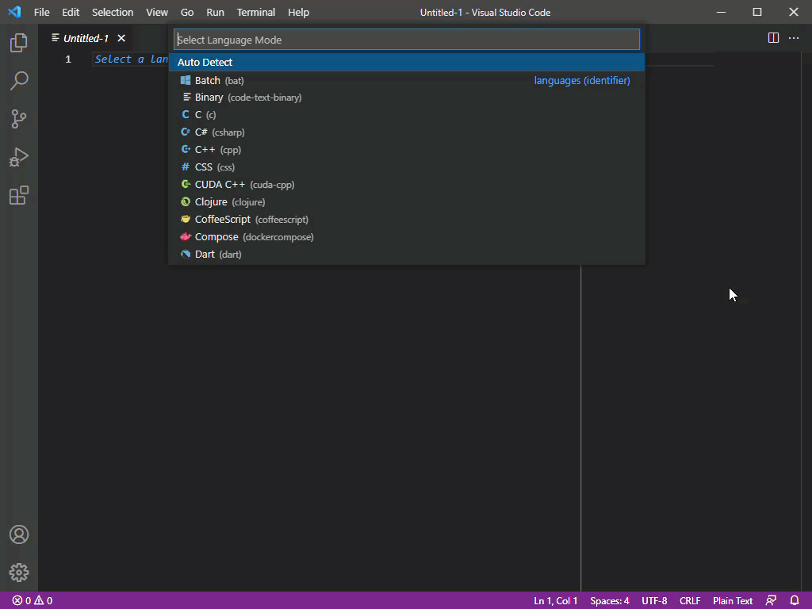
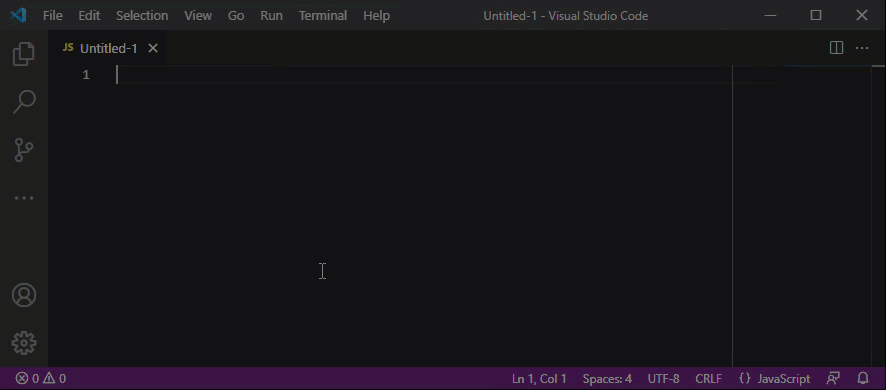
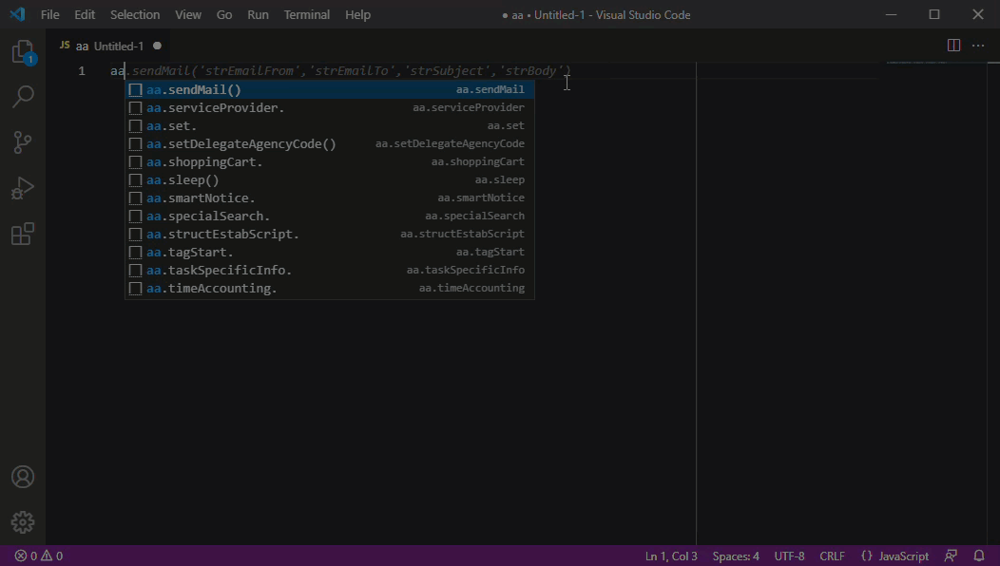
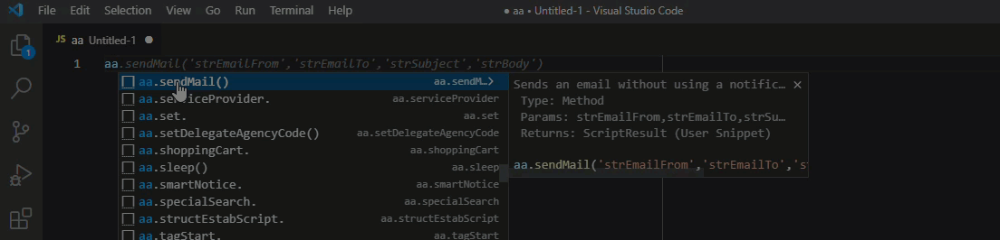
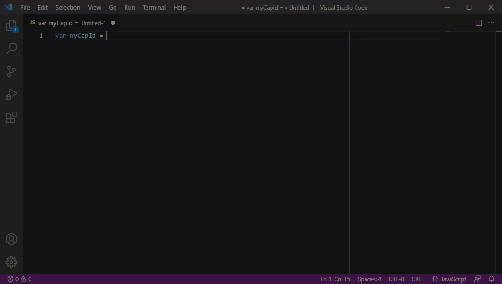

# Accela EMSE Snippets README

A [Visual Studio Code](https://code.visualstudio.com/) snippet extension to provide a library of intellisense support on the 9.2 EMSE Accela API, along with some other helpful code that can be run in Script Tester.
A [Visual Studio Code](https://code.visualstudio.com/) snippet extension to provide a library of intellisense support on the EMSE Accela API, along with some other helpful code that can be run in Script Tester.

Primarily designed for creating and editing Master Scripts 3.0 events, batches, pageflows, expressions, or other scripts written with the standard Rhino JS framework.

I make updates in my free time.  If you like the extension and have found it useful, you can buy me a coffee so I can work late into the night to keep updating it! [https://www.buymeacoffee.com/objectic](https://www.buymeacoffee.com/objectic)
 
 
 
### Getting Started

 
The Accela EMSE Library extension supports code writing for Master Scripts 3.0. To begin, create a new Javascript file or open an existing .js file.

From there, trigger intellisense to see a list of commands, or start typing a snippet prefix.  These Snippets are typically accessed with their class names, for the script root it's `aa` or using the item's name wrapped in periods like `.cap.`

 

The intellisense library is loaded with the script root's methods and classes, access it by typing `aa`. This is the starting point for accessing the other classes and methods documented in EMSE: 

 

### Additional Details

Most items have additional info loaded in. It is sourced from the EMSE description and return value.  When viewing the intellisense list, open an item's description with the `>` toggle:

 

### Tab Stops

Each parameter has a tab stop. Stay on the home row, tab through them without having to slow down:

 

### Drilling Down

Need to chain into other classes but are a little unsure where to go? No problem!  Start with your root object and select the item you want, like `aa.cap`. Then trigger intellisense again to get the collection of methods for the class. Overloaded methods are appended with a number, step through with arrow keys to see which parameters they take.

When finished, copy the script into ScriptTester and run

 

#
## Other Snippet Commands
 
There are a couple other useful snippets for supporting development and testing within Script Tester.  Check out

* `_scripttestfunctions` loads some helper functions
    * print(str) - Simply removes the aa root for logging to the debug window
    * parseObj(obj) - Add any object and run the code to get a print out of its contents or available methods

* `_scripttestcapid` enters a few lines of code to generate a capId and cap object from a record AltID, useful as a starting point to explore a particular record.

* `ScriptResult.code_block` Adds in the standard .getSuccess()/.getOutput() code block to convert a ScriptResult variable into its output.

* `_scripttestincludes` Loads the INCLUDES_ files commonly found on events. Dynamically attempts to interpret the environment's settings to cover the range of possible implementations:  If the standard choice EMSE_EXECUTE_OPTIONS has the value USE_MASTER_SCRIPTS:Yes, then INCLUDES_ACCELA_ and INCLUDES_GLOBAL are retrieved from Events>Master Scripts. INCLUDES_CUSTOM is loaded from Events>Custom Script as long as no file exists in Events>Scripts called 'INCLUDES_CUSTOM'.  Standard Choice controls are typically not activated.

 

#
## List of Classes and Models available
 

| Class/Model | Description | Access With |
| ----------- | ----------- | ----------- |
| aa | The script root object | aa |
| address | com.accela.aa.emse.dom.AddressScript | .address. |
| appSpecificInfo | com.accela.aa.emse.dom.service.AppSpecificInfoScriptService | .appSpecificInfo. |
| calendar | com.accela.aa.emse.dom.service.CalendarScriptService | .calendar. |
| cap | com.accela.aa.emse.dom.CapScript | .cap. |
| capCondition | com.accela.aa.emse.dom.CapConditionScript | .capCondition. |
| CapModel | com.accela.aa.aamain.cap.CapModel | capModel. |
| capId | com.accela.aa.emse.dom.CapIDScriptModel | capId. |
| document | DocumentScript | .document. |
| env | com.accela.aa.emse.emse.ScriptEnvironment | .env. |
| examination | ExaminationScript | .examination. |
| expirations | com.accela.aa.emse.dom.ExpirationScript | .expiration. |
| guidesheet | com.accela.aa.emse.dom.service.GuidesheetScriptService | .guidesheet. |
| inspection | com.accela.aa.emse.dom.service.InspectionScriptService | .inspection. |
| invoice | com.accela.aa.emse.dom.InvoiceScript | .invoice. |
| parcel | com.accela.aa.emse.dom.ParcelScript | .parcel. |
| people | com.accela.aa.emse.dom.PeopleScript | .people. |
| publicUser | com.accela.aa.emse.dom.service.PublicUserScriptService | .publicUser. |
| owner | com.accela.aa.emse.dom.OwnerScript | .owner. |
| set | com.accela.aa.emse.dom.service.SetScriptService | .set. |
| util | com.accela.aa.emse.dom.service.UtilScriptService | .util. |
| workflow | com.accela.aa.emse.dom.service.WorkflowScriptService | .workflow. |
|  |  |  |

 
 
#
## Related VS Code Settings and
 

If you are new to VS Code, here are some snippet settings and commands that may impact the experience. These settings are applied globally and are not exclusive to this extension.
* To trigger Intellisense, use `Ctrl+Space` (Windows,linux) or `Cmd+Space` (Apple) Many of the items in this extension will require intellisense to be triggered after your selection to see the next level of choices.

* To change the whether snippets are completed by the `tab` key, change the `editor.tabCompletion` setting to on, off, or onlySnippets.

* The intellisense suggestion order can be rearranged. Change the value in the setting `editor.snippetSuggestions`:
    * top: show above other suggestions
    * bottom: show below other suggestions
    * inline: show snippets mixed in with everything else
    * none: turn them off
* Snippets providing suggestions can be toggled with the setting `editor.suggest.snippetsPreventQuickSuggestions`: true or false

 
<<<<<<< Updated upstream
 

#
## Known Issues
 
The 9.2 EMSE API javadoc is parsed to provide the foundation of these snippets.  Due to the size and consistency of the javadoc, the intellisense suggestions may be incomplete or missing.  Basically, some of it requires a human touch to improve.   

For example, the InspectionScript method returns are often blank and placed in the description of the method. We are actively working on cleaning up the snippet library and are open to feedback and fixes.

Reach out on the Discord channel to let others know about this extension and give feedback for corrections.

Some code blocks, like `_scripttestincludes` are designed to capture a range of potential client configurations but may not be compatible with all system designs. The code snippet code can be tweaked to meet agency needs.

 
 
**Enjoy!**
=======
 
>>>>>>> Stashed changes
